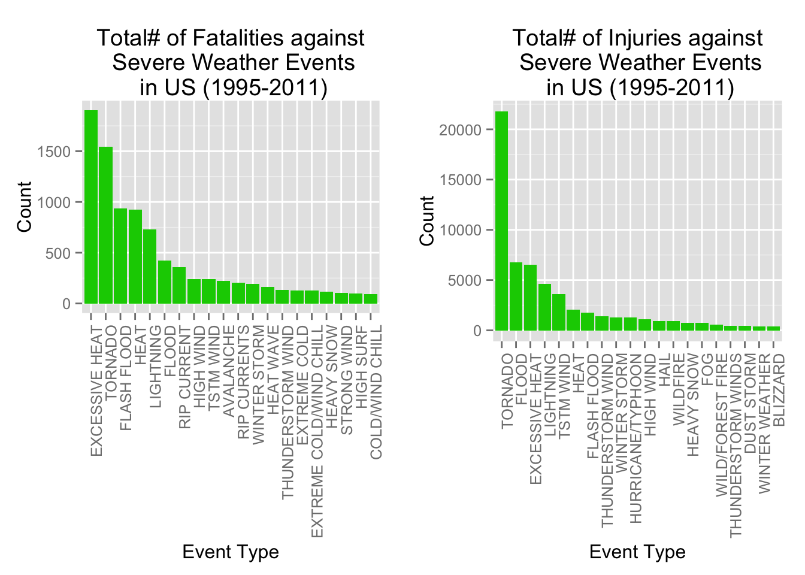
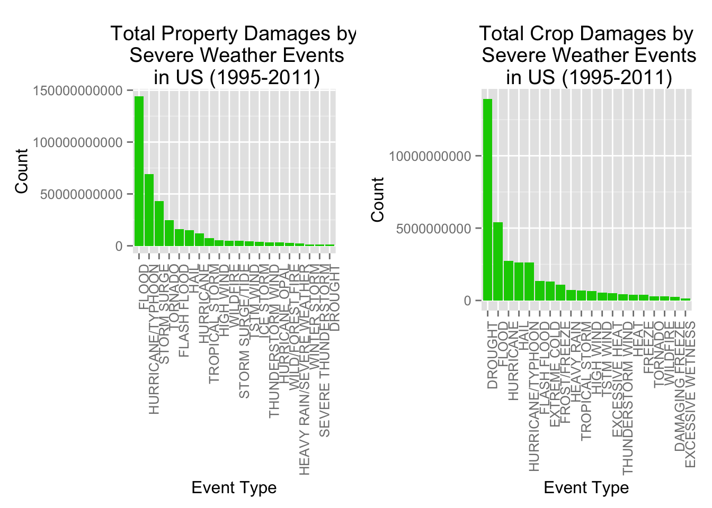

    
**Important Note:** *Kindly visit the below link for an updated report for this Peer Assessment. The plots are available in the figures folder.  
[Link to my RPubs](http://rpubs.com/bram/reproducibleresearch2)   
[Link to my Reproducible Research Repository](https://github.com/buva-datascience/RepData_PeerAssessment2)*    
  
## Impact of Severe Weather Events on Public Health and Economy in the United States during 1950-2011

# Synopsis
As part of this analysis and research report, our goal is to explore the United States National Oceanic and Atmospheric Administration's (NOAA) Storm Database from 1950 - 2011 and answer some basic questions about severe weather events. We aim to address the impacts of Severe Weather events on Public Health and related economic consequences across United States, by looking at the Storm Data from NOAA database. Specifically, we will analyze the Fatalities, Injuries, Property/Crop damages and the estimates documented over the years for our research to determine the type of events which are most harmful to the population health and for the US economy. Based on our research and analysis, we found that **Tornado** and **Excessive Heat** are the most harmful for the population health, while **flood, drought, Hail/Flood and Hurricanes** have the greatest economic consequences.

# Basic Parameter settings
```r
# Set Working Directory
wd <- "~/Documents/Buva/Data Science/Data Science Course-John Hopkins/05-Reproducible Research/Peer Assessment#2"
setwd(wd)

echo = TRUE                     # Always make code visible
options(scipen = 1)             # Turn off scientific notations for numbers
library(R.utils)
library(ggplot2)
library(grid)
require(gridExtra)
```

# Data Processing  
    
*The data processing is done as following:  
 1. Source file "**StormData.csv.bz2**" is downloaded if not present  
 2. Source data is unzipped using bzfile() function and read via the read.csv() function  
 3. Examine the dataframe using dim() and names() functions* 

```r
# function to Download the file from the website location to the local directory
dwld_file <- function(fileurl, dest){
        if (!file.exists("data")) dir.create("data")                            # create a folder if it doesnt exist        
        
        if (!file.exists(dest)) {                                               # download the file if its not already downloaded
                download.file(fileurl, destfile = dest, method = "curl")
        }  
}

# Assign Data file destination and doc file destination
dest="./data/stormdata.csv.bz2"

# 1. Call funtion to download from the url
dwld_file("https://d396qusza40orc.cloudfront.net/repdata%2Fdata%2FStormData.csv.bz2", dest)

# 2. Read the downloaded bzfile to a dataframe
StormData <- read.csv(bzfile(dest), header=TRUE)

# 3. Examine using Head and names functions
dim(StormData)

# Display column names
names(StormData)
```

There are `r length(rownames(StormData))` rows and `r length(names(StormData))` variables/columns in total. The events in the database start in the year 1950 and end in November 2011. In the earlier years of the database there are generally fewer events recorded, most likely due to a lack of good records. More recent years should be considered more complete.

```r
# Format Date to see how the data is distributed over years
StormData$year <- as.numeric(format(as.Date(StormData$BGN_DATE, format = "%m/%d/%Y %H:%M:%S"), "%Y"))
hist(StormData$year, breaks=50)
```  
  
   
    
As observed from the above histogram, the number of events tracked starts to significantly increase around 1995. So, we use the subset of the data from 1995 to 2011 for a better analysis from most out of good records.  

```r
# Filter StormData from 1995
Data <- StormData[StormData$year >= 1995, ]
dim(Data)
```
After filtering data after 1995, there are `r dim(Data)[1]` rows and `r dim(Data)[2]` columns. However we dont need the entire columns. For our analysis, we are interested only in looking at the Fatalities, Injuries, Property and Crop Damages and their estimations for the Event types. So we can further filter the dataset to narrow down to the columns which we would like to focus for our research. We do the following:  
 1. Identify the columns required for research  
 2. Filter the Dataset for the required columns  
 3. Examine column names and data with head() and names() functions   

```r
# 1. Identify the Required columns for this research
ReqdCols <- c("EVTYPE", "FATALITIES", "INJURIES", "PROPDMG", "PROPDMGEXP", "CROPDMG", "CROPDMGEXP")

# 2. Filter the StormData set with the reqd columns
FilteredStormData <- Data[, ReqdCols]

# 3. Display column names 
names(FilteredStormData)
head(FilteredStormData)
```
  
# Impact on Public Health
To address First part of the question from this assignment, we check the number of fatalities and injuries that are caused by the severe weather events. We would like to get the first 20 most severe types of weather events. We have done the following:  
 1. Group and sum all Fatalities for all the event types
 2. Assign new column names for the aggregate data set
 3. Order the new dataset in the descending order and take out the top 20 for our analysis
 4. Refresh the factor levels for the filtered dataset
 Repeat Steps 1-4 for analysing the Injuries  
 
```r
# 1. Group and sum all Fatalities for the all of the event types
Fatalities <- aggregate( FilteredStormData$FATALITIES, by=list(FilteredStormData$EVTYPE), sum)

# 2. Assign Column names
names(Fatalities) <- c("EventType", "Consequences")

# 3. Filter the top 20 Fatalities
Fatalities <- Fatalities[order(-Fatalities$Consequences), ] [1:20, ]

# 4. Refresh the factor levels with the new Fatalaties subset
Fatalities$EventType <- factor(Fatalities$EventType, levels = Fatalities$EventType)

# Repeat Steps 1-4 for Injuries
# 1. Group and sum all Injuries for the all of the event types
Injuries <- aggregate( FilteredStormData$INJURIES, by=list(FilteredStormData$EVTYPE), sum)

# 2. Assign Column names
names(Injuries) <- c("EventType", "Consequences")

# 3. Filter the top 20 Injuries
Injuries <- Injuries[order(-Injuries$Consequences), ] [1:20, ]

# 4. Refresh the factor levels with the new Injuries subset
Injuries$EventType <- factor(Injuries$EventType, levels = Injuries$EventType)
```
  
# Impact on United States Economy  
*For the Second part of a question, we check the number of Property and Corp Damages caused by the severe weather events. In addition to that we also need to calculate the financial damages from the exponential data stored in the databse. The following sequence of steps are performed to prepare for our analysis on economy impacts:  
 1. Display more details on PropertyDamanageEXP and CropDamageEXP variables    
 2. Assign the numeric value which will be exponentially applied for calculating the Financial Damages; B for billion, M for million, k for kilo, h for hundred     
 3. Check for missing values if any  
 4. Convert and Assign the PropertyDamageEXP variable to the numeric new variable created  
 5. Compute the Financial Property Damages    
 Repeat the steps 1-5 for the calculating the Crop damages*    
   
```r
options(scipen = 999)
# 1. Display more details on PropertyDamanageEXP variable
summary(FilteredStormData$PROPDMGEXP)

# 2. Assign the numeric value which will be exponentially applied for calculating the Financial Damages
# B for billion, M for million, k for kilo, h for hundred; 
FilteredStormData$PROPDMGEXP <- as.character(FilteredStormData$PROPDMGEXP)
FilteredStormData$PROPDMGEXP[toupper(FilteredStormData$PROPDMGEXP) == "B" ] <- "9"
FilteredStormData$PROPDMGEXP[toupper(FilteredStormData$PROPDMGEXP) == "M" ] <- "6"
FilteredStormData$PROPDMGEXP[toupper(FilteredStormData$PROPDMGEXP) == "K" ] <- "3"
FilteredStormData$PROPDMGEXP[toupper(FilteredStormData$PROPDMGEXP) == "H" ] <- "2"
FilteredStormData$PROPDMGEXP[toupper(FilteredStormData$PROPDMGEXP) == "" ]  <- "0"

# 3. Check for missing values
sum(is.na(as.numeric(FilteredStormData$PROPDMGEXP)))
FilteredStormData$PROPDMGEXP[is.na(as.numeric(FilteredStormData$PROPDMGEXP))] <- 0
sum(is.na(as.numeric(FilteredStormData$PROPDMGEXP)))

# 4. Convert and Assign the PropertyDamageEXP variable to the numeric new variable created
#FilteredStormData$numericPROPDMGEXP[complete.cases(FilteredStormData$PROPDMGEXP)] <- as.numeric(FilteredStormData$PROPDMGEXP[complete.cases(FilteredStormData$PROPDMGEXP)])
FilteredStormData$PROPDMGEXP <- as.numeric(FilteredStormData$PROPDMGEXP)

# 5. Compute the Financial Property Damages
FilteredStormData$FinancialDmgPROP <- FilteredStormData$PROPDMG * 10^(FilteredStormData$PROPDMGEXP)

# Repeat the same process for the CROPDMG
# 1. Display more details on CropDamageEXP variable
summary(FilteredStormData$CROPDMGEXP)

# Assign the numeric value which will be exponentially applied for calculating the Financial Damages
# B for billion, M for million, k for kilo, h for hundred; 
FilteredStormData$CROPDMGEXP <- as.character(FilteredStormData$CROPDMGEXP)
FilteredStormData$CROPDMGEXP[toupper(FilteredStormData$CROPDMGEXP) == "B" ] <- "9"
FilteredStormData$CROPDMGEXP[toupper(FilteredStormData$CROPDMGEXP) == "M" ] <- "6"
FilteredStormData$CROPDMGEXP[toupper(FilteredStormData$CROPDMGEXP) == "K" ] <- "3"
FilteredStormData$CROPDMGEXP[toupper(FilteredStormData$CROPDMGEXP) == "H" ] <- "2"
FilteredStormData$CROPDMGEXP[toupper(FilteredStormData$CROPDMGEXP) == "" ]  <- "0"

# 3. Check for missing values
sum(is.na(as.numeric(FilteredStormData$CROPDMGEXP)))
FilteredStormData$CROPDMGEXP[is.na(as.numeric(FilteredStormData$CROPDMGEXP))] <- 0
sum(is.na(as.numeric(FilteredStormData$CROPDMGEXP)))

# 4. Convert and Assign the PropertyDamageEXP variable to the numeric new variable created
#FilteredStormData$numericCROPDMGEXP[complete.cases(FilteredStormData$CROPDMGEXP)] <- as.numeric(FilteredStormData$CROPDMGEXP[complete.cases(FilteredStormData$CROPDMGEXP)])
FilteredStormData$CROPDMGEXP <- as.numeric(FilteredStormData$CROPDMGEXP)

# 5. Compute the Financial CROP Damages
FilteredStormData$FinancialDmgCROP <- FilteredStormData$CROPDMG * 10^(FilteredStormData$CROPDMGEXP)
```
  
  Now that the financial damages are calculated for both the Property and the Crop Damages, we can now look at the Property and Crop Damages caused by the Severe Weather events. Again, we focus on the first 20 most severe types of weather events. *We have done the following:  
 1. Group and sum all PropertyDamage for all the event types  
 2. Assign new column names for the aggregate data set  
 3. Order the new dataset in the descending order and take out the top 20 for our analysis  
 4. Refresh the factor levels for the filtered dataset  
 Repeat the steps 1-4 for the CROPDamage*  
  
```r
# 1. Group and sum all PropertyDamages for the all of the event types
PROPDamage <- aggregate( FilteredStormData$FinancialDmgPROP, by=list(FilteredStormData$EVTYPE), sum)

# 2. Assign Column names
names(PROPDamage) <- c("EventType", "Consequences")

# 3. Filter the top 20 Property Damage values
PROPDamage <- PROPDamage[order(-PROPDamage$Consequences), ] [1:20, ]

# 4. Refresh the factor levels with the new Property Damage subset
PROPDamage$EventType <- factor(PROPDamage$EventType, levels = PROPDamage$EventType)

# Repeat the same process for the Crop Damage
# 1. Group and sum all CropDamages for the all of the event types
CROPDamage <- aggregate( FilteredStormData$FinancialDmgCROP, by=list(FilteredStormData$EVTYPE), sum)

# 2. Assign Column names
names(CROPDamage) <- c("EventType", "Consequences")

# 3. Filter the top 20 Crop Damage values
CROPDamage <- CROPDamage[order(-CROPDamage$Consequences), ] [1:20, ]

# 4. Refresh the factor levels with the new Crop Damage subset
CROPDamage$EventType <- factor(CROPDamage$EventType, levels = CROPDamage$EventType)
```
  
# Results
**Part1: **From our research we have completed our analysis/findings and have arrived at the top 20 most Severe Weather event types that cause the most number of Public Health Fatalities/Injuries respectively:  

```r
Fatalities  
```  
  
```
##                   EventType Consequences
## 112          EXCESSIVE HEAT         1903
## 666                 TORNADO         1545
## 134             FLASH FLOOD          934
## 231                    HEAT          924
## 358               LIGHTNING          729
## 144                   FLOOD          423
## 461             RIP CURRENT          360
## 288               HIGH WIND          241
## 683               TSTM WIND          241
## 16                AVALANCHE          223
## 462            RIP CURRENTS          204
## 787            WINTER STORM          195
## 233               HEAT WAVE          161
## 607       THUNDERSTORM WIND          131
## 121            EXTREME COLD          126
## 122 EXTREME COLD/WIND CHILL          125
## 254              HEAVY SNOW          115
## 524             STRONG WIND          103
## 280               HIGH SURF           99
## 70          COLD/WIND CHILL           95
```
  
```r
Injuries
```  
  
```
##              EventType Consequences
## 666            TORNADO        21765
## 144              FLOOD         6769
## 112     EXCESSIVE HEAT         6525
## 358          LIGHTNING         4631
## 683          TSTM WIND         3630
## 231               HEAT         2030
## 134        FLASH FLOOD         1734
## 607  THUNDERSTORM WIND         1426
## 787       WINTER STORM         1298
## 313  HURRICANE/TYPHOON         1275
## 288          HIGH WIND         1093
## 206               HAIL          916
## 773           WILDFIRE          911
## 254         HEAVY SNOW          751
## 157                FOG          718
## 771   WILD/FOREST FIRE          545
## 632 THUNDERSTORM WINDS          444
## 103         DUST STORM          420
## 792     WINTER WEATHER          398
## 27            BLIZZARD          385
```
  
To best illustrate, the following pair of graph plots depict the total Public Health Fatalities and Injuries affected by the Severe Weather event types across United States during the period 1995 - 2011:  
```r
# Plot Fatalities graph
g1 <- ggplot(Fatalities, aes(x = EventType, y = Consequences)) + geom_bar(stat = "identity", fill = "555", 
                                                      las = 3) + theme(axis.text.x = element_text(angle = 90, hjust = 1)) + xlab("Event Type") + 
        ylab("Count") + ggtitle("Total# of Fatalities against Severe Weather Events in US (1995-2011)")

# Plot Injuries graph
g2 <- ggplot(Injuries, aes(x = EventType, y = Consequences)) + geom_bar(stat = "identity", fill = "555", 
                                                             las = 3) + theme(axis.text.x = element_text(angle = 90, hjust = 1)) + xlab("Event Type") + 
        ylab("Count") + ggtitle("Total# of Injuries against Severe Weather Events in US (1995-2011)")

# Arrange the plots in a grid
grid.arrange(g1, g2, ncol=2)
```  
  
  
    
From the above histograms, we observe that **Excessive Heat** and **Tornado** cause most fatalities; **Tornato** causes most injuries in the United States from 1995 to 2011.    
    
**Part2: **Regarding the economic consequences, we have arrived at the top 20 most Severe Weather event types that caused economical disasters on Public Property/Food and Crop damages respectively:      
```r
PROPDamage
```

```
##                     EventType Consequences
## 144                     FLOOD 144022037057
## 313         HURRICANE/TYPHOON  69305840000
## 519               STORM SURGE  43193536000
## 666                   TORNADO  24935939545
## 134               FLASH FLOOD  16047794571
## 206                      HAIL  15048722103
## 306                 HURRICANE  11812819010
## 677            TROPICAL STORM   7653335550
## 288                 HIGH WIND   5259785375
## 773                  WILDFIRE   4759064000
## 520          STORM SURGE/TIDE   4641188000
## 683                 TSTM WIND   4482361440
## 326                 ICE STORM   3643555810
## 607         THUNDERSTORM WIND   3399282992
## 310            HURRICANE OPAL   3172846000
## 771          WILD/FOREST FIRE   3001812500
## 247 HEAVY RAIN/SEVERE WEATHER   2500000000
## 787              WINTER STORM   1538047250
## 479       SEVERE THUNDERSTORM   1200310000
## 84                    DROUGHT   1046106000
```
  
```r
CROPDamage
```

```
##             EventType Consequences
## 84            DROUGHT  13922066000
## 144             FLOOD   5422810400
## 306         HURRICANE   2741410000
## 206              HAIL   2614127070
## 313 HURRICANE/TYPHOON   2607872800
## 134       FLASH FLOOD   1343915000
## 121      EXTREME COLD   1292473000
## 179      FROST/FREEZE   1094086000
## 241        HEAVY RAIN    728399800
## 677    TROPICAL STORM    677836000
## 288         HIGH WIND    633561300
## 683         TSTM WIND    553947350
## 112    EXCESSIVE HEAT    492402000
## 607 THUNDERSTORM WIND    414354000
## 231              HEAT    401411500
## 159            FREEZE    396225000
## 666           TORNADO    296595770
## 773          WILDFIRE    295472800
## 76    DAMAGING FREEZE    262100000
## 117 EXCESSIVE WETNESS    142000000
```

To best illustrate, the following pair of graph plots depict the total Public Property damages and Crop Damages influenced by the Severe Weather event types across United States during the period 1995 - 2011:    
```r
# Plot Property Damage graph
g3 <- ggplot(PROPDamage, aes(x = EventType, y = Consequences)) + geom_bar(stat = "identity", fill = "555", 
                                                             las = 3) + theme(axis.text.x = element_text(angle = 90, hjust = 1)) + xlab("Event Type") + 
        ylab("Count") + ggtitle("Total Property Damages by Severe Weather Events in US (1995-2011)")

# Plot Crop Damage graph
g4 <- ggplot(CROPDamage, aes(x = EventType, y = Consequences)) + geom_bar(stat = "identity", fill = "555", 
                                                             las = 3) + theme(axis.text.x = element_text(angle = 90, hjust = 1)) + xlab("Event Type") + 
        ylab("Count") + ggtitle("Total Crop Damages by Severe Weather Events in US (1995-2011)")

# Arrange the plots in a grid
grid.arrange(g3, g4, ncol=1)
```
  
  
    
From the above histograms, we observe that **Flood** and **Hurricane/Typhoons** cause most Property Damages; **Flood** causes more Crop Damages in the United States from 1995 to 2011.  
  
# Conclusion  
  
To Conclude the research, from the NOAA's Storm Data, we found that **Excessive Heat** and **Tornado** are most harmful with respect to population health, while **Flood, Drought** and **Hurricane/Typhoon** have the greatest economic consequences.    
*Free up the environment memory as we have completed the assignment !*
```r
rm(list=ls())
```

